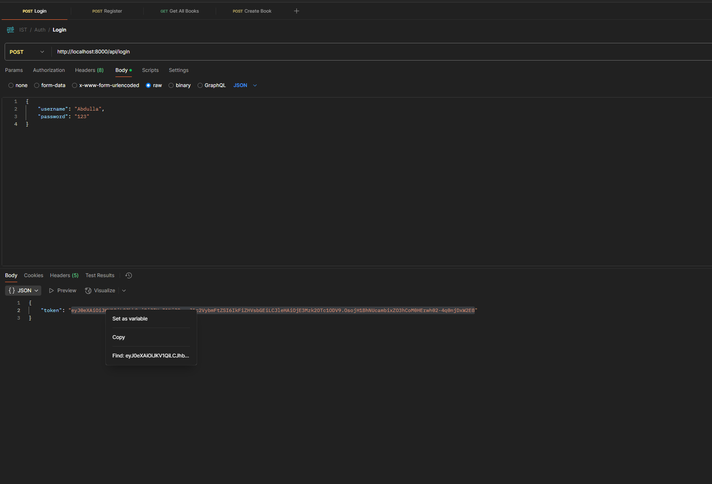
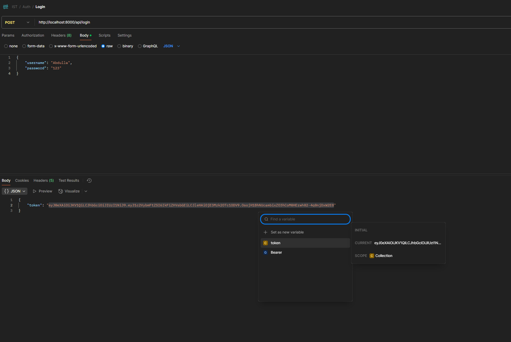

## before Start

- Tried with OpenAPI and Huggingface API.
  - OpenAPI - "You exceeded your current quota ..." No more fre Tier
  - Huggingface API - "Summery not accurate"

- Using Google Gemini API for summery
----

### **Note:** All `/api/books` and `/api/books/generate-summary` endpoints require the `Authorization` header:

- Authorization
    - **Note:** An environment variable called `token` has been defined.
      Use that to set the value so it will automatically update the API Authorization Bearer for all requests. (screenshot added in Bottom)
    ```text
    Authorization: Bearer your_jwt_token
     ```

- **Postman Collection has provided**. use that to test the API. (`screenshot/IST.postman_collection.json`)

----------------------
## Tools used
1. PHPStorm (Code IDE)
2. Navicat (for database)
3. XAMPP (for localhost server)
4. Postman (for API testing)
----------------------

## Setup & Running the API
1. **Requirements:**
    - PHP 8.3
    - sqlite

2. **Running the API:**
    - Use PHP's built-in server:
      ```bash
      php -S localhost:8000
      ```
    - The API endpoints will be available at `http://localhost:8000`.

3. **API Endpoints:**

    - **User Authentication:**
        - `POST /api/register`  
          Request Body (JSON):
          ```json
          {
            "username": "your_username",
            "password": "your_password"
          }
          ```
        - `POST /api/login`  
          Request Body (JSON):
          ```json
          {
            "username": "your_username",
            "password": "your_password"
          }
          ```
          Response:
          ```json
          {
            "token": "your_jwt_token"
          }
          ```

    - **Books:**
        - `GET /api/books` – Retrieve all books
        - `GET /api/books/{id}` – Retrieve a book by ID
        - `POST /api/books` – Create a new book  
          Request Body (JSON):
          ```json
          {
            "title": "Book Title",
            "author": "Author Name",
            "published_year": 2021
          }
          ```
        - `PUT /api/books/{id}` – Update a book
        - `DELETE /api/books/{id}` – Delete a book

    - **AI Agent Integration:**
        - `POST /api/books/generate-summary`  
          Request Body (JSON):
          ```json
          {
            "book_id": 1
          }
          ```
----- 
## Set variable in Postman Collection
- Step 01


- Step 02
